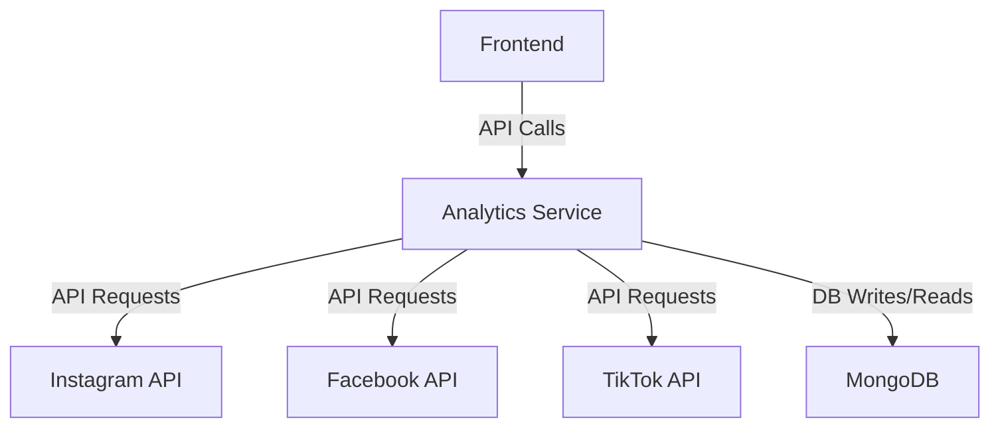
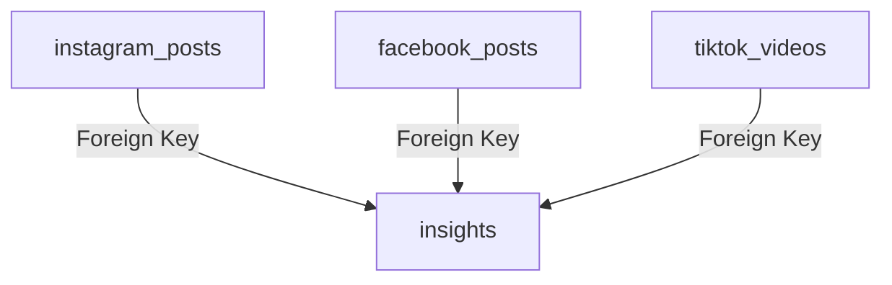
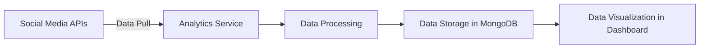

# Analytics Service

## System Architecture Diagram

## Database Schema Diagram

## Data Flow Diagram
    

***insights**: This collection would store the processed or analyzed data—essentially the insights you generate from the raw data.