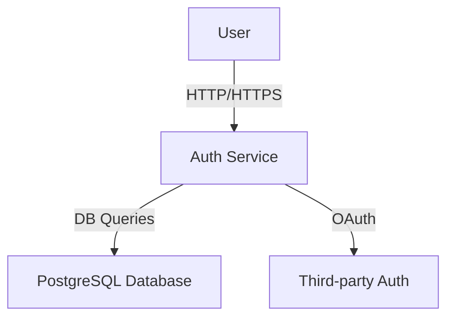
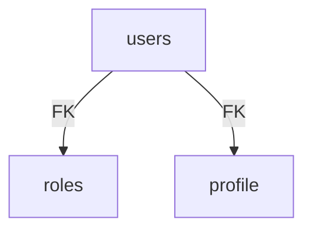
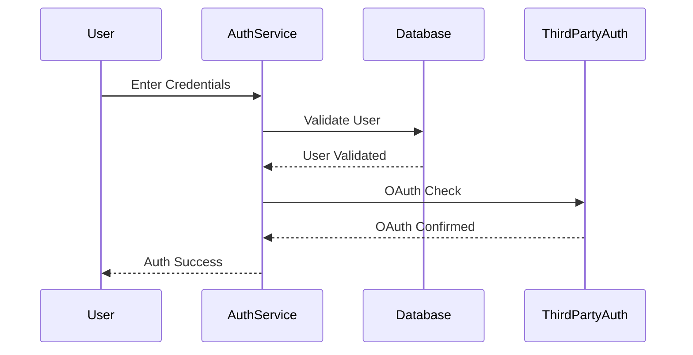

# Auth Service

## System Architecture Diagram

```mermaid
graph TD;
    A[User] -->|HTTP/HTTPS| B[Auth Service]
    B -->|DB Queries| C[PostgreSQL Database]
    B -->|OAuth| D[Third-party Auth]
```

## Database Schema Diagram

```mermaid
graph TD;
    A[users] -->|FK| B[roles]
    A -->|FK| C[profile]
```

## Sequence Diagram for Authentication Flow

```mermaid
sequenceDiagram
    participant User
    participant AuthService
    participant Database
    participant ThirdPartyAuth
    User->>AuthService: Enter Credentials
    AuthService->>Database: Validate User
    Database-->>AuthService: User Validated
    AuthService->>ThirdPartyAuth: OAuth Check
    ThirdPartyAuth-->>AuthService: OAuth Confirmed
    AuthService-->>User: Auth Success
```
