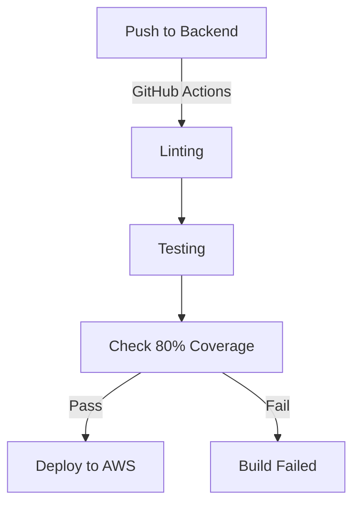

# CI/CD Pipeline Documentation

## Overview

This document outlines the CI/CD pipeline implemented using GitHub Actions. The pipeline covers both backend (FastAPI) and frontend (ReactJS) components and deploys them to an AWS infrastructure managed via Terraform.

## Backend CI/CD Pipeline

## Phases

### 1. Build

The first phase of the CI/CD pipeline involves building the codebase.

FastAPI Microservices
* Run flake8 for linting
* Run pytest for tests
* Run coverage for test coverage

ReactJS Frontend

* Install npm dependencies
* Build ReactJS application

### 2. Deploy

The second phase involves deploying the built codebase to AWS.

Terraform initialization and apply
GitHub Actions Workflow Files
.github/workflows/backend.yml and .github/workflows/frontend.yml define the workflow steps.