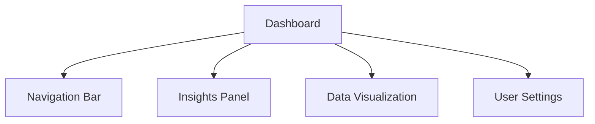
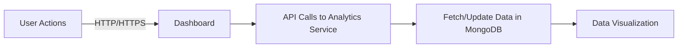

# Dashboard

## UI components diagram

```mermaid
graph TD;
    A[Dashboard] --> B[Navigation Bar]
    A --> C[Insights Panel]
    A --> D[Data Visualization]
    A --> E[User Settings]
```

## Data Flow Diagram

```mermaid
graph LR;
    A[User Actions] -->|HTTP/HTTPS| B[Dashboard]
    B --> C[API Calls to Analytics Service]
    C --> D[Fetch/Update Data in MongoDB]
    D --> E[Data Visualization]
```