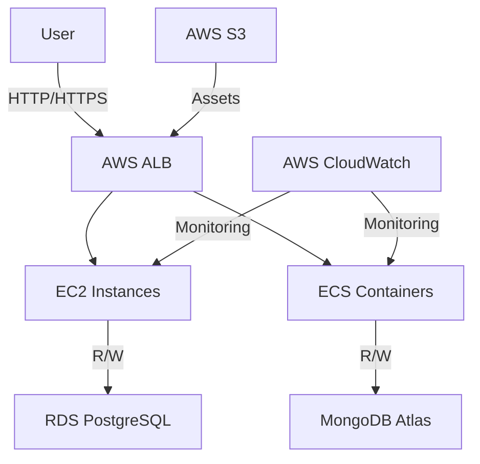
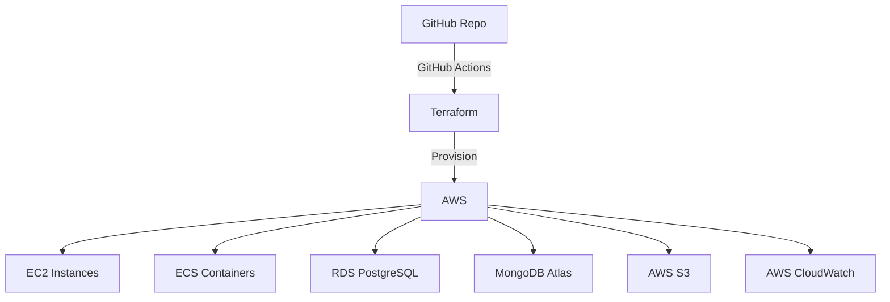

# Infrastructure

## Architecture Diagram



## Terraform Architecture Diagram



## Terraform Directory Structure

```bash
terraform/
├── modules/
│   ├── ec2/
│   │   └── main.tf
│   │   └── variables.tf
│   │   └── outputs.tf
│   ├── rds/
│   │   └── main.tf
│   │   └── variables.tf
│   │   └── outputs.tf
│   ├── s3/
│   │   └── main.tf
│   │   └── variables.tf
│   │   └── outputs.tf
│   ├── ecs/
│   │   └── main.tf
│   │   └── variables.tf
│   │   └── outputs.tf
│   └── alb/
│       └── main.tf
│       └── variables.tf
│       └── outputs.tf
├── environments/
│   ├── dev/
│   │   └── main.tf
│   │   └── variables.tf
│   │   └── outputs.tf
│   └── prod/
│       └── main.tf
│       └── variables.tf
│       └── outputs.tf
└── main.tf
└── variables.tf
└── outputs.tf
└── terraform.tfstate
└── terraform.tfstate.backup
```

**modules/**: This directory contains reusable code pieces. You can have modules for EC2 instances, RDS, and ALB (Application Load Balancer).

* **main.tf**: The main file where resources are defined.
* **variables.tf**: Input variables for the module.
* **outputs.tf**: Output variables for the module.

**environments/**: You can separate your environments into individual directories (like dev and prod). This allows you to have different configurations for different environments but use the same modules.

**main.tf**: The entry point where you define which modules to use and configure providers (like AWS).

**variables.tf**: Here you define the variables that you can pass into your Terraform configurations.

**outputs.tf**: Any outputs that your Terraform configurations should produce. Useful for extracting information like IPs

**terraform.tfvars**: This file contains the values for the variables defined in variables.tf.

**terraform.tfstate**: This file contains the state of your infrastructure. It is used by Terraform to map real-world resources to your configuration, keep track of metadata, and to improve performance for large infrastructures.

## Terraform Commands

```bash
# Initialize Terraform
terraform init

# Validate Terraform
terraform validate

# Plan Terraform
terraform plan

# Apply Terraform
terraform apply

# Destroy Terraform
terraform destroy
```
