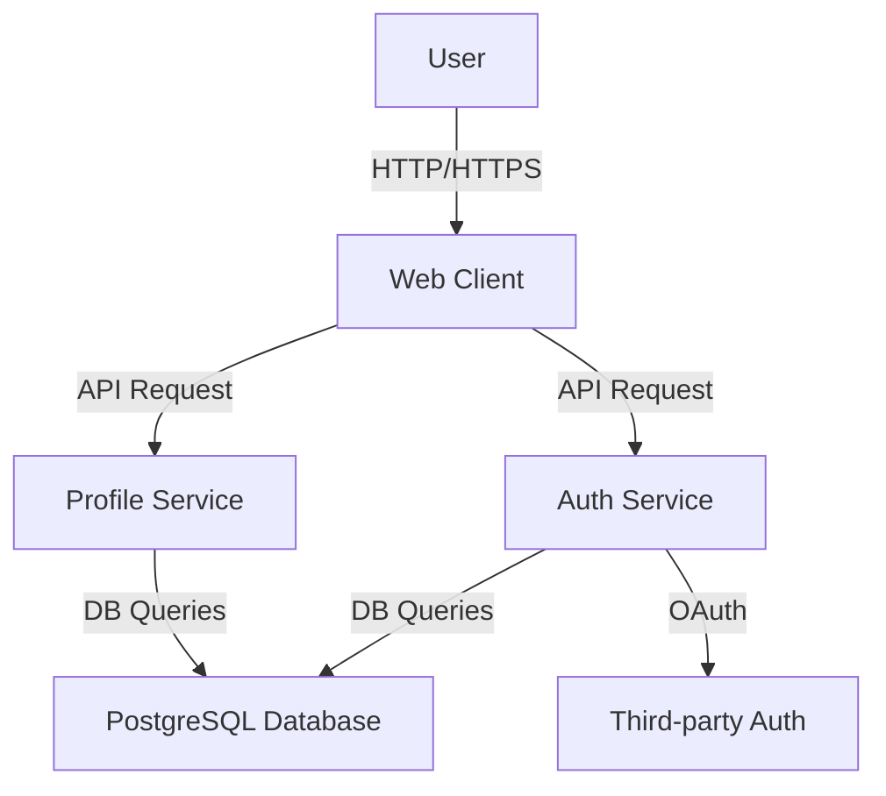

# Overall Architecture

```mermaid
graph TD;
    A[User] -->|HTTP/HTTPS| B[Web Client]
    B -->|API Request| C1[Auth Service]
    B -->|API Request| C2[Profile Service]
    C1 -->|DB Queries| D1[PostgreSQL Database]
    C2 -->|DB Queries| D1[PostgreSQL Database]
    C1 -->|OAuth| E[Third-party Auth]
```