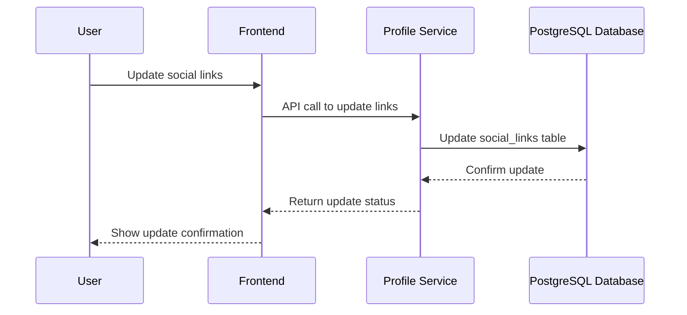

# Profile service

## Overview

This document outlines the profile service, which handles user profiles and social media account linking.

## Sequence Diagram

```mermaid
sequenceDiagram
    participant U as User
    participant F as Frontend
    participant P as Profile Service
    participant DB as PostgreSQL Database

    U->>F: Update social links
    F->>P: API call to update links
    P->>DB: Update social_links table
    DB-->>P: Confirm update
    P-->>F: Return update status
    F-->>U: Show update confirmation
```
